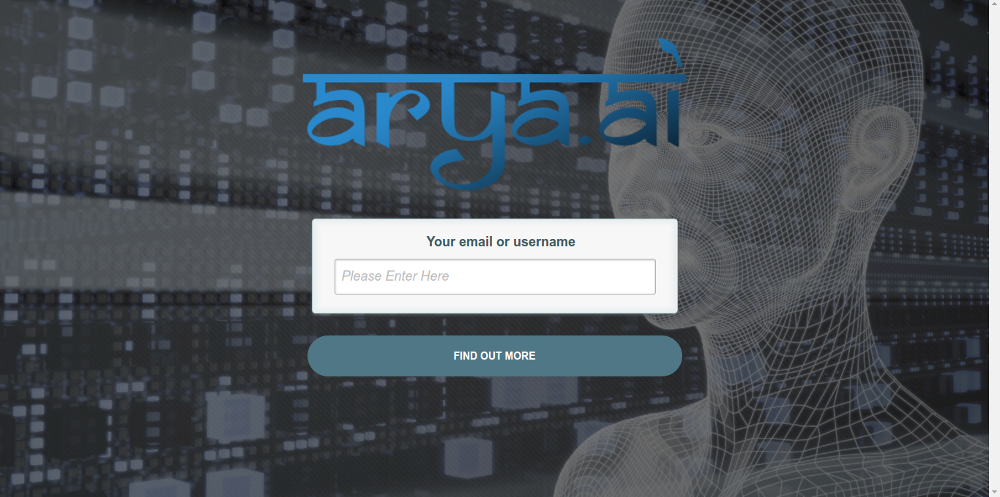
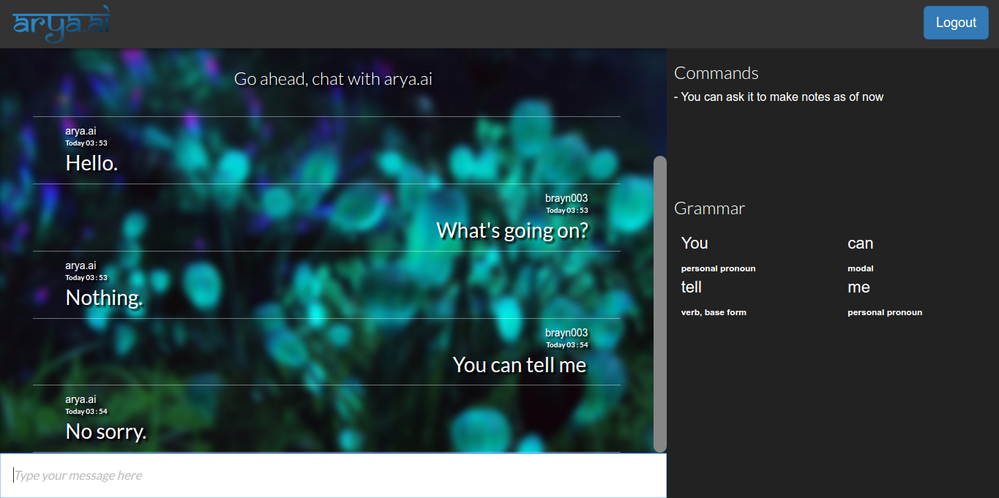
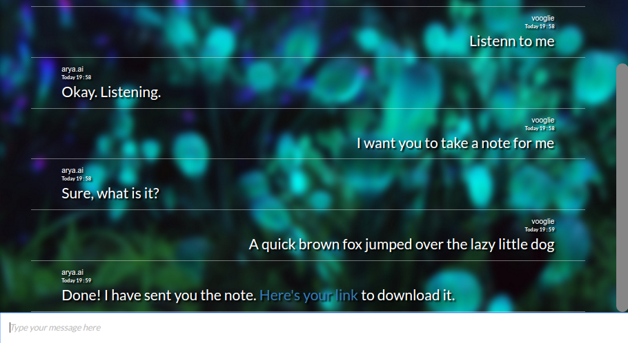
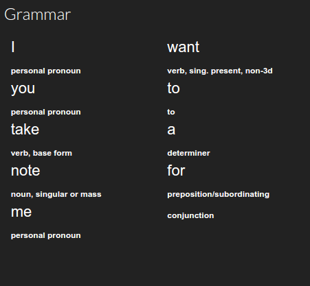
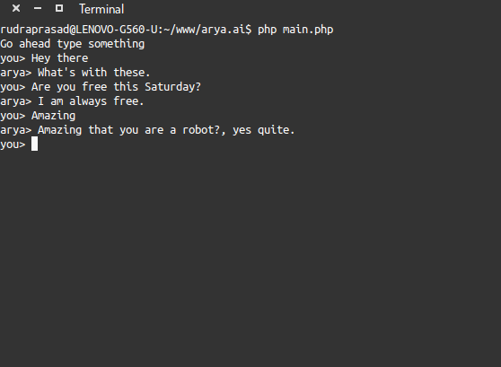

# arya.ai
A chatter bot application which can recognize certain commands and act accordingly. It's like your virtual personal assisstant.

## Setup
Following need to be installed before you can run the application
- apache >= 2.4.7 
- PHP >= 5.5.9
  (LAMP stack or any other alternative is recommended)
- JRE/JDK >= 1.7

### For web interface
To run the application, clone the repository into your `www` folder (in case of LAMP or WAMP) or 'htdocs' (in case of XAMPP). After cloning the repository open up your browser and visit one of the following urls.
```
http://localhost/arya.ai
```
or
```
http://127.0.0.1/arya.ai
```

### For CLI
Clone the repository, get into the root folder of the repo and use the following command.
```bash
php main.php
```

## Functionality
There are two core functionalities of Arya, as of now
1. Chatting with cleverbot
2. Asking it to execute some tasks

### Chat
The bot chats with the user and is constantly learning. Its an implementation of cleverbot itself. User discretion is advised.

### Tasks
As of now, Arya can only create new notes. To create a new note you must ask the chatter bot to `take a note` or `make a note` or any other alternative sentence. The meaning of the sentence should imply that you want Arya to take a note. Notes are currently saved in the `tmp` folder of the project. An auto download prompt is given to the user when this command is executed from the web interface.

## Screenshots

### Web Interface
*User Login*



*Web Chat*



*Take Note*


### CLI

*Grammar*


### CLI

*CLI Chat*



## Disclaimer
I am not the owner of Cleverbot/JabberWacky nor Pandorabots.

## Credits
- [pierredavidbelanger/chatter-bot-api](https://github.com/pierredavidbelanger/chatter-bot-api) for providing the PHP version of chatterbox API.
- [agentile/PHP-Stanford-NLP](https://github.com/agentile/PHP-Stanford-NLP) for providing a PHP wrapper for Standford NLP POS tagger.
- [Stanford NLP POS tagger](http://nlp.stanford.edu/software/tagger.shtml) for providing core Stanford NLP POS tagger.

## License
License details have been provided in LICENSE.txt and applies to the whole project.